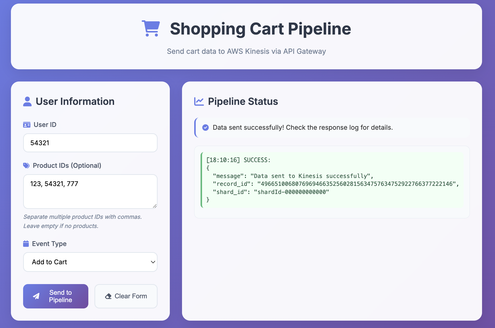
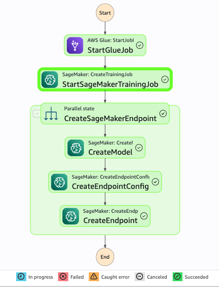

# 🚀 AWS Real-Time Product Recommendation Pipeline



## 📋 Overview

A serverless real-time product recommendation system using AWS services. Combines streaming data processing with machine learning to provide personalized product recommendations.

### Key Features

- 🤖 **Real-Time ML Recommendations** via SageMaker XGBoost
- 🌊 **Streaming Data Pipeline** with Kinesis and Firehose  
- ⚡ **Serverless Architecture** with auto-scaling
- 🌐 **Modern Web App** with global CDN
- 🔄 **Automated ML Pipeline** with Step Functions

## 🏗️ Architecture

```
Web App → API Gateway → Lambda → SageMaker → Recommendations
     ↓         ↓                      ↑
   User    Kinesis → Firehose → S3   DynamoDB Features
```

**Core Components:**
- **Web App + CloudFront**: Global UI for product recommendations
- **API Gateway + Lambda**: Handle requests and ML inference  
- **SageMaker**: XGBoost model for real-time recommendations
- **DynamoDB**: Pre-computed user/product features
- **Kinesis → Firehose → S3**: Stream user data for analytics
- **Step Functions**: Orchestrates ML pipeline (Glue → Training → Deployment)



## 🤖 Machine Learning

**XGBoost Model** for user-product purchase prediction:
- **Features**: User behavior, product popularity, interaction history
- **Training**: Automated via Step Functions (Glue → SageMaker → Endpoint)
- **Inference**: < 500ms response time with auto-scaling
- **Storage**: Features in DynamoDB, model artifacts in S3

## 📁 Project Structure

```
kinesis/
├── environments/dev/     # Terraform configuration
├── modules/              # AWS service modules
│   ├── lambda/          # Lambda functions + ML inference
│   ├── sagemaker/       # ML training and endpoints  
│   ├── step-functions/  # ML pipeline orchestration
│   ├── api-gateway/     # REST API endpoints
│   └── ...              # Other AWS services
├── webapp/               # Web application
└── .github/workflows/    # GitHub Actions deployment
```

## 🚀 Deployment

### 🤖 GitHub Actions (Recommended)

1. **Fork this repository** and add AWS secrets:
   - `AWS_ACCESS_KEY_ID`
   - `AWS_SECRET_ACCESS_KEY`

2. **Go to Actions → "Deploy Kinesis Pipeline"** and run in phases:
   - **Phase 1**: ✅ Deploy AWS S3s
   - **Phase 2**: ✅ Deploy AWS ML Pipeline (auto-runs training)
   - **Phase 3**: ✅ Deploy AWS Real Time Pipeline

### 🛠️ Manual Terraform

1. **Initialize**
   ```bash
   cd environments/dev && terraform init
   ```

2. **Deploy Core Infrastructure**
   ```bash
   terraform apply -target=module.s3 -target=module.dynamodb -target=module.glue_job
   ```

3. **Deploy ML Pipeline**
   ```bash
   terraform apply -target=module.step_functions
   make execute-step-function
   ```
   
   This automatically:
   - Processes data and engineers features
   - Trains the XGBoost recommendation model
   - Deploys the SageMaker inference endpoint

4. **Package Lambda Functions**
   ```bash
   cd modules/lambda && ./create_package.sh
   cd modules/glue-job && ./create_wheel.sh
   cd ../../environments/dev
   ```

5. **Deploy services**
   ```bash
   terraform apply -target=module.lambda -target=module.api_gateway
   terraform apply -target=module.kinesis -target=module.firehose -target=module.s3_webapp -target=module.cloudfront
   ```

6. **Deploy web app**
   ```bash
   make update-api-url
   make deploy-webapp BUCKET_NAME=<Your-Buck-Name>
   ```

**Access URLs:**
   ```bash
   terraform output cloudfront_domain_name  # Web app
   terraform output api_gateway_url         # API endpoint
   ```

## 🧪 Testing

```bash
curl -X POST https://your-api-gateway-url/submit \
  -H "Content-Type: application/json" \
  -d '{"user_id": "123", "event": "get_recommendations"}'
```

**Expected Response:**
```json
{
  "message": "Recommendations generated successfully", 
  "recommendations": [
    {"product_id": "123", "probability": 0.85, "product_name": "Organic Bananas", ...}
  ]
}
```

## 🛠️ Development

**Local Development:**
```bash
# Web app
cd webapp && npm install && node server.js

# Terraform validation  
terraform validate && terraform plan
```

**Key Files:**
- `modules/lambda/lambda_function.py` - ML inference logic
- `modules/step-functions/state-machine.json` - ML pipeline definition
- `webapp/js/app.js` - Frontend recommendation display

## Author
Chien Yeh

