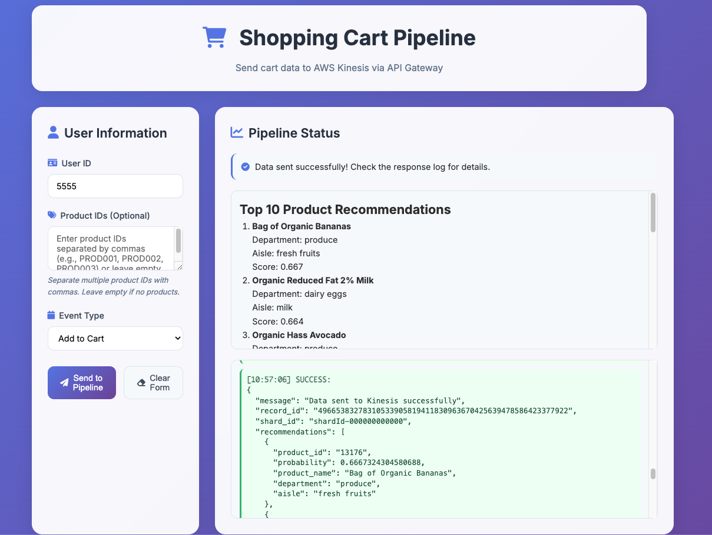

# 🚀 AWS Kinesis Data Pipeline with Web Application



## 📋 Project Overview

This project implements a real-time data streaming pipeline using AWS services:

### Architecture Components

- **Web Application**: Modern UI for data input
- **API Gateway**: An HTTP API or REST API endpoint for receiving data
- **Lambda Function** (`main` branch only): Processes and forwards data to Kinesis
- **Kinesis Data Stream**: Real-time data streaming
- **Firehose**: Batch delivery to S3
- **S3 Bucket**: Data storage

## 🏗️ Architecture

This project implements a comprehensive serverless architecture using AWS services to build a real-time product recommendation system. The architecture consists of the following components:

- **Web Application**: A modern UI for user interaction and data input.
- **API Gateway**: Serves as the entry point for HTTP requests, triggering AWS Lambda functions.
- **Lambda Functions**: Handle data processing, feature fetching, and interaction with the SageMaker endpoint.
- **SageMaker Endpoint**: Provides real-time inference for product recommendations using a trained XGBoost model.
- **Kinesis Data Stream**: Facilitates real-time data streaming.
- **Firehose**: Delivers batched data to S3 for storage.
- **S3 Bucket**: Stores raw and processed data, as well as model artifacts.
- **DynamoDB**: Stores feature data for real-time access by Lambda functions.
- **CloudFront**: Distributes the web application globally with low latency.

### Data Flow

1. **Web Application**: Users interact with the web app to submit shopping cart data.
2. **API Gateway**: Receives HTTP POST requests and triggers Lambda functions.
3. **Lambda Function (Data Processing)**: Processes incoming data and forwards it to Kinesis.
4. **Kinesis Data Stream**: Streams data in real-time to Firehose.
5. **Firehose**: Batches and delivers data to S3 for long-term storage.
6. **Glue Job**: Performs feature engineering and stores features in DynamoDB.
7. **DynamoDB**: Provides fast access to feature data for real-time recommendations.
8. **SageMaker Notebook**: Trains the model using the processed data and saves the model to S3.
9. **SageMaker Endpoint**: Hosts the trained model for real-time inference.
10. **Lambda Function (Inference)**: Fetches features from DynamoDB, scales input data, and invokes the SageMaker endpoint to get recommendations.
11. **API Gateway**: Returns the recommendations to the web application for display.

This architecture ensures scalability, low latency, and efficient data processing, making it suitable for real-time product recommendation systems.

## 🤖 Machine Learning Model

This project utilizes an XGBoost model for generating product recommendations in real-time. The model is trained using historical shopping cart data and engineered features to predict the likelihood of a user purchasing a product.

### Model Training

- **Data Preparation**: Features are engineered using AWS Glue and stored in DynamoDB.
- **Training Environment**: The model is trained in a SageMaker Notebook using the XGBoost algorithm.
- **Model Artifacts**: The trained model is saved to an S3 bucket for deployment.

### Real-Time Inference

- **SageMaker Endpoint**: The trained XGBoost model is deployed as a real-time inference endpoint in SageMaker.
- **Lambda Function**: Fetches features from DynamoDB, scales the input data, and invokes the SageMaker endpoint to obtain product recommendations.
- **API Gateway**: Returns the recommendations to the web application for display to the user.

This setup allows for scalable and efficient real-time product recommendations, enhancing the user experience by providing personalized suggestions.

## 🎯 Features

### Web Application

- ✅ Modern responsive UI
- ✅ Form validation
- ✅ Real-time feedback
- ✅ Multiple event types

### Infrastructure

- ✅ Serverless architecture
- ✅ Auto-scaling
- ✅ Secure IAM roles
- ✅ CloudWatch logging

## 📁 Project Structure

```
kinesis/
├── environments/dev/        # Terraform configuration
├── modules/                 # Terraform modules
├── webapp/                  # Web application
├── Makefile                 # Build automation
└── README.md                # This file
```

## 🚀 Deployment Workflow

To deploy the entire system, follow these steps:

1. **Deploy Glue Job, S3, and DynamoDB:**

   ```bash
   terraform apply -target=module.glue_job -target=module.s3 -target=module.dynamodb
   ```

   Run the Glue job to perform feature engineering and store features in DynamoDB.

2. **Train Model with SageMaker:**

   ```bash
   terraform apply -target=module.sagemaker_notebook
   ```

   Run the SageMaker notebook to train the model, which will be saved in S3.

3. **Deploy SageMaker Inference Endpoint:**
   Use the model stored in S3 to deploy a SageMaker inference endpoint.

   ```bash
   terraform apply -target=module.sagemaker_endpoint
   ```

4. **Package Lambda Function with Scaler:**
   Download `scaler.pkl` from S3 and package it with the Lambda function (with numpy, pandas, and scikit-learn).

   ```bash
   ./create_package.sh
   ```

5. **Deploy Lambda and API Gateway:**

   ```bash
   terraform apply -target=module.lambda -target=module.api_gateway
   ```

6. **Deploy Kinesis, Firehose, and Web Application:**

   ```bash
   terraform apply -target=module.kinesis -target=module.firehose -target=module.s3_webapp -target=module.cloudfront
   ```

7. **Update API URL and Deploy Web Application:**
   ```bash
   make update-api-url
   make deploy-webapp
   ```

The web UI URL and API Gateway URL can be found after deploying by GitHub Action workflow.

- **CloudFront URL**: `https://your-cloudfront-domain.cloudfront.net`
- **S3 Website URL**: `http://your-bucket-name.s3-website-ap-southeast-2.amazonaws.com`

This workflow ensures that all components are deployed in the correct order and dependencies are managed effectively.

## 🌐 Web UI Deployment

### Architecture

```
Web App Files → S3 Bucket → CloudFront → Global CDN
```

### Features

- ✅ **Automatic API URL Updates**: From Terraform outputs
- ✅ **Cross-Platform Support**: macOS and Ubuntu
- ✅ **Cache Invalidation**: Automatic CloudFront cache clearing
- ✅ **Secure Access**: S3 only accessible via CloudFront
- ✅ **HTTPS Support**: SSL certificates via CloudFront
- ✅ **Global CDN**: Fast worldwide access

### Troubleshooting

#### API Gateway URL Issues

1. Check API Gateway is deployed and active
2. Run `make update-api-url` to update the URL
3. Run `make deploy-webapp` to upload updated files

## 🛠️ Development
